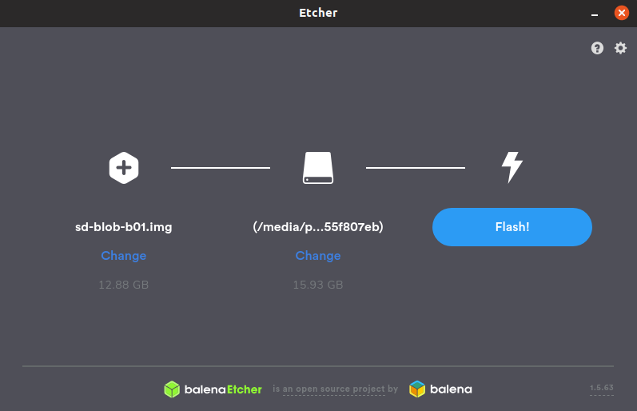

# Jetson Nano GPU - Tutorial
## Pedro de la Peña, Embarcados Avançados, Insper 2019/2

Neste projeto iremos utilizar uma placa Jetson Nano para comparar a diferença no desempenho de um código sendo executado em CPU VS GPU.

## Pré Requisitos

Para seguir este tutorial, é necessário:<br>
**- Conexão com a internet**; <br>
**- Hardware**: Jetson Nano; <br> 
**- Hardware**: SD Card 16 GB OU 32 GB (preferível); <br> **- Hardware**: Teclado e Mouse USB; <br> 
**- Hardware**: Monitor com entrada HDMI; <br>
**- Hardware**: Câmera Raspberry Pi 2.1 OU Câmera USB; <br>
**- Software**: Baixar imagem https://developer.nvidia.com/jetson-nano-sd-card-image-r3221 <br>

## Arquitetura da placa Jetson Nano
A placa Jetson Nano possui uma GPU integrada além de sua CPU ARM Cortex-A57 Quad-Core, o que a faz ser muito utilizada em aplicações de processamento de imagens e também em *Machine Learning* com o uso de redes neurais. 
A lista completa de seus componentes e especificações está a seguir:


## NVIDIA Tegra X1 SoC (GPU)
A Jetson Nano possui um *System On a Chip* (SoC) Tegra X1 Maxell, frequentemente encontrado em tablets que são baseados no sistema Android. Este SoC possibilita o uso softwares como OpenGL, CUDA e também DirectX. Com um *clock* máximo de até 1000 MHz, a GPU oferece 256 *shader-cores* e é capaz de codificar vídeos em 30fps e decodificar em 60fps.

## Configurando o sistema operacional no SD card

Após realizar o download da imagem, conecte o SD card em um adaptador e então no seu computador. Agora é preciso extrair a imagem e copiá-la para o driver de maneira que o sistema operacional funcione. Para realizar o processo utilizando utilizando uma interface gráfica, [faça o dowload do Etcher](https://www.balena.io/etcher/). O processo de *flashing* é um pouco demorado, levando cerca de 10-15 minutos. Você pode meditar um pouco ou então pode ir dar uma volta e tomar um café!



Caso você prefira realizar o processo de forma mais *raiz*, você também o pode fazer pela linha de comando. Para isto, descubra o nome e localização do seu flash drive com `dmesg | tail`. Após encontrar o drive, extraia o arquivo para o SD card com o comando:

```
$ bash /usr/bin/unzip -p ~/[LOCAL_DE_DOWNLOAD]/jetson_nano_devkit_sd_card.zip 
$ sudo /bin/dd of=/dev/sd[NOME_DO_DRIVE] bs=1M status=progress
```
Após finalizado o processo, remova o drive de seu computador.

## Inserindo o SD card na placa Jetson Nano

A entrada do cartão de memória não é muito visível para aqueles que estão tendo o primeiro contato com a placa. Aqui há uma imagem para auxilia-lo(a) a encontrar a entrada do cartão: 


## Primeiro boot

Com o cartão de memória já inserido, é preciso conectar os cabos na placa. Não há "botão de ligar ou desligar" na placa, e o boot começa automaticamente quando ambos cabos de energia (supply de 5V (USB) e fonte) estiverem conectados. Além disso, lembre-se que <u>será preciso conexão com a internet para os próximos passos</u>.

Após inserir as configurações de formato de teclado, região e informações 'pessoais' do ambiente Linux, a placa reiniciará e então estará pronta para uso.


Para maior comodidade, recomenda-se que a suspensão automática e *screen lock* sejam desativadas em `All Settings -> Brightness & Lock`, dado que alguns downloads e instalações possam demorar *um pouco*.

## Atualizando libs e packages

Já que acabamos de configurar o sistema operacional, é necessário executar os comandos `sudo apt-get update` e `sudo apt-get upgrade`.

## Configurando o ambiente Python

Para instalar bibliotecas adicionais, é preciso instalar o pip. Para isto, execude os comandos a seguir:

```
$ wget https://bootstrap.pypa.io/get-pip.py
$ sudo python3 get-pip.py
```

## Configurando o Ambiente OpenCV
Esse aqui demora... E MUITO! (~4 horas)

```
$ wget https://github.com/AastaNV/JEP/blob/master/script/install_opencv4.1.1_Jetson.sh
$ sudo sh install_opencv4.1.1_Jetson.sh
$ export PYTHONPATH=/usr/local/python
```

## Configurando o ambiente CUDA

```
$ wget http://developer.download.nvidia.com/compute/cuda/10.2/Prod/local_installers/cuda_10.2.89_440.33.01_linux.run
$ sudo sh cuda_10.2.89_440.33.01_linux.run
```

## Instalação Pytorch

A biblioteca Pytorch possui funções que tornam possível a utilização da GPU no ambiente Python. Esta biblioteca será utilizada para fazer alguns testes e comparações mais para frente no tutorial.

```
$ wget https://nvidia.box.com/shared/static/phqe92v26cbhqjohwtvxorrwnmrnfx1o.whl -O torch-1.3.0-cp36-cp36m-linux_aarch64.whl
$ pip3 install numpy torch-1.3.0-cp36-cp36m-linux_aarch64.whl
```

Caso algum erro de dependência relacionado ao numpy ocorra, reinstale-o.

```
$ sudo pip uninstall numpy
$ pip3 install numpy --user
```

## CPU vs GPU
A diferença no desempenho de certos códigos executados em CPU ou GPU é dada pela quantidade de cálculos em paralelo que cada um dos hardwares consegue realizar. Dependendo da arquitetura dos hardwares, uma GPU pode executar centenas - ou até milhares - de vezes mais instruções por *clock* em relação à CPU. Por conta disto, GPUs são largamente utilizadas em processos que podem ser amplamente divididos e paralelizados em blocos, como é o caso da multiplicação de matrizes com muitas linhas e colunas. O simples exemplo a seguir deixa evidente a diferença no desempenho.


Código em CPU

```
import numpy as np
import time

x = np.random.rand(7000,16)
y = np.random.rand(16, 7000)
start = time.time()
z = np.matmul(x,y)
end = time.time()

print(z)
print("\nElapsed time CPU:",end-start,"seconds")
```


Código em GPU
```
import torch
import time

x = torch.randn(7000,16)
y = torch.randn(16, 7000)
start = time.time()
z = torch.matmul(x, y)
end = time.time()

print(z)
print("\nElapsed time GPU:",end-start,"seconds")
```

A GPU também é de fundamental uso em outras aplicações como a rederização de vídeos e imagens e também no treinamento de modelos de Machine Learning e redes neurais.

# O que falta no tutorial...

## Instalação da Câmera

Caso esteja utilizando uma câmera USB, pule esta etapa.
(completar)

## Exemplo e comparação OpenCV vs OpenCV CUDA
Descobri que os frames por segundo da renderização de vídeo (cv2.videoCapture(0)) é definida por um parâmetro e não por estar em GPU ou CPU, o que literalmente quebrou o propósito da minha ideia de projeto inicial.

